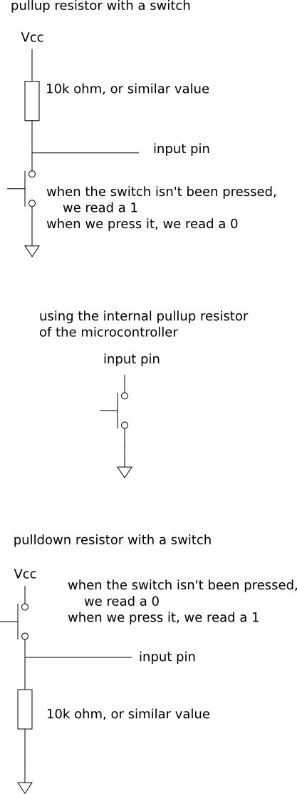

# Documentation #

This code was thought out to work and tested on a arduino uno board (or any board using an atmega328p microcontroller).

It may work with others microcontrollers, with a few changes - if you want to make it work in other microcontrollers just send me an email or something, and I can help port it.

There's several elements presented here (sound/led..) but you don't have to use them all! Use what you want/need. The strictly necessary for a working metronome is the 'Tempo' object. You can then add the rest in any way you would like.

In the code, you'll see that there's two 'main' files (main.cpp and simple_main.cpp). The first one is showing all the stuff, but may not be that easy to read and understand how the program works, so if you're starting out, try out the simple_main.cpp first!
(keep in mind that when creating a project and trying to compile the code, you can only add one of them to the project).

Any suggestions or bugs found, please add them in the 'Issues' tab.

Note: For the LCD display, I'm using the library [PCD8544](http://code.google.com/p/pcd8544/).

Here's a picture, showing the messy circuit :)

[Here's a video showing off the metronome](images/metronome_controller.avi)

# Installation steps #

Here I'll give a short guide to setting up your environment.

I'll be using [code::blocks](http://www.codeblocks.org/) as the IDE (integrated development environment) for this guide (since its cross-platform).

First, install codeblocks and get the source code.

You'll need to install the avr toolchain (the compiler, standard libraries, ...) as well.

On unix-like systems, use your package manager and install:

 * gcc-avr
 * binutils-avr
 * avr-libc
 * gdb-avr
 * avrdude

on windows, install [winAVR](http://winavr.sourceforge.net/)

## Setting up a project in codeblocks ##

 * create new project
 * avr project
 * just follow the instructions (be sure to choose the processor (for example atmega328p))

 * remove the main.c that the project automatically creates
 * copy the source code to your project folder
 * go project -> add files recursively (it automatically adds all the files)
 * or project -> add files, to add just the ones you want
 * be sure to have only one main.cpp file in the project

 * if you're on the debug mode, add a flag for optimizations (otherwise the _delay_ms() function will complain). go to project -> build options and check one optimization there.

## Compiling ##

 * to compile, just go build -> build, and hope it works :)

 * (on windows, it probably will complain about the toolchain path not being correct, if so, go to settings -> compiler and debugger -> select the GNU AVR GCC Compiler -> toolchain executables -> and on the compiler's installation directory, add the path where you installed winavr (or click auto-detect, works as well)

 * the compiled file, will be on yourProjectFolder/bin/Debug or /bin/Release (by default its the Debug).

## Send to the board ##

To send it to the board, you can use the avrdude program.

Open a console on the /bin/debug/ folder, and here depends on what board you're using, and on  which platform, but for example, with an arduino uno board and on linux, the command is:

`avrdude -p m328p -c arduino -P /dev/ttyACM0 -U flash:w:metronome_controller.elf.hex`

You may have to give permissions to write to it (you can add yourself to whatever group it belongs to, or just: `chmod 777 /dev/ttyACM0` -- not the best approach but does work :p)

On windows, just change the /dev/ttyACM0 for COMx, where x depends on which port you connect it (to see which, open Device Manager -> Ports (COM & LPT) and it should appear there).

## Automate ##

You could automate this by adding the command in codeblocks - project -> build options -> pre/post build	steps -> add that line at the end (you should see other commands there, like avr-objcopy (...))

Alternatively, you could create a user-defined tool, and only send to the board when you execute that tool.

Go to tools -> configure tools -> add

where:
 * name: whatever you want
 * executable: avrdude
 * parameters (make the appropriate changes): -p m328p -c arduino -P /dev/ttyACM0 -U flash:w:${TARGET_OUTPUT_BASENAME}.elf.hex
 * working directory: ${PROJECT_DIR}/${TARGET_OUTPUT_DIR}

# Wiring schematics for the various elements #

## Switch ##

----

## Led ##

----

## Piezo speaker ##

